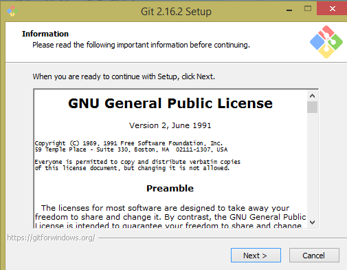
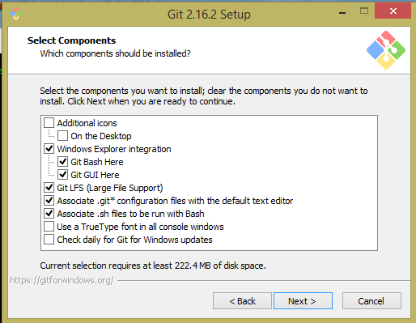
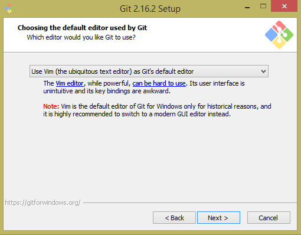
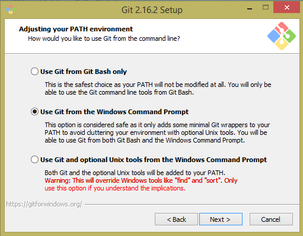
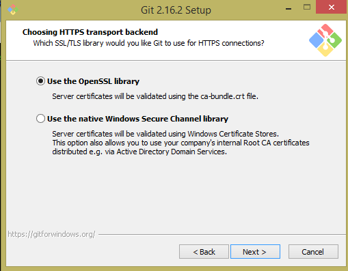
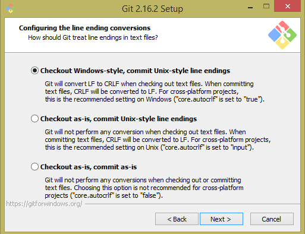
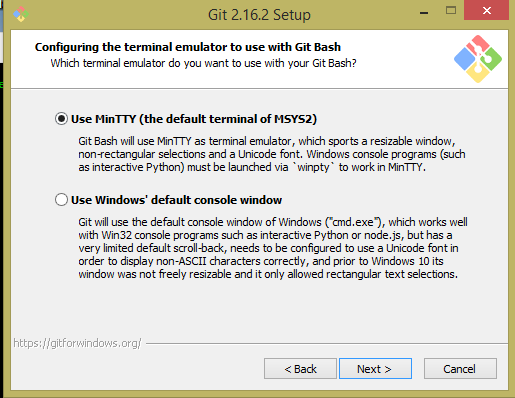
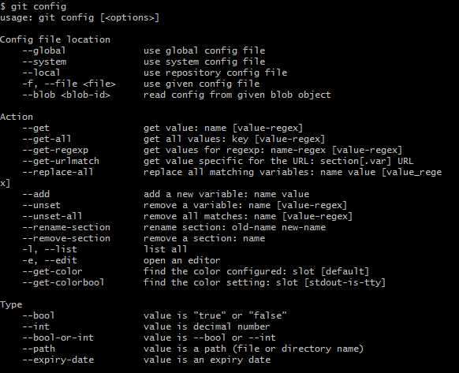

# Steps for using Git in Windows

* First install [Git](http://git-scm.com/download/win) into your windows machine.Once you install ".exe" file, click on it and install Git on your computer. The steps are simple, it will automatically direct you through the installation process. Simple ! follow the steps,

## Steps of installing **Git**
 
 
 
 
  
 
   
 
 
 
 
 
 
 
 
 
* Continue the last two steps and click on "install". Once the installation is completed, open **"Git Bash"** from **"Start"** menu in your computer. Once, Git Bash prompt window appears, you can start working on Git. The main tool in Git is **git config**, you can explore the list of options for using **Git Bash** by typing git config command in the editor window. 
 
  
  
  * To get help of using Git, you can simply type 
  
  $ git help <name>  
 
 (**Of course!** you won't type < or > )
 
 Example:  If you want to help with using add in Git,  $ git config add
 
 
 * Connecting to your GitHub account if you have already created a GitHub account in  [GitHub website](https://github.com/join?source=header-home)
 
 $ git config --global user.name "username"
 $ git config --global user.email "youremail"
 
 Ex: $ git config --global user.name "JohnR" and  $ git config --global user.email "john@email.com"

 
* Once you connect to your GitHub account, now you can go to your GitHug account and create a new repository.
